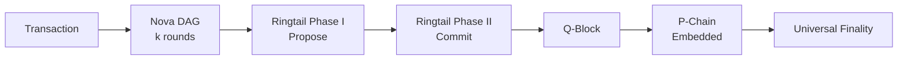
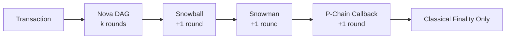

# Lux Consensus

Welcome to **Lux Consensus**—the world's first unified quantum-secure consensus engine. By replacing Avalanche's complex Snowman++ with a streamlined Nova + Ringtail PQ architecture, Lux achieves both classical AND quantum finality in the same number of rounds that Avalanche needs for classical finality alone.

## 🏆 Revolutionary Achievement

**Quasar = Nova + Ringtail PQ = Classical + Quantum Finality in k+2 rounds**

While Avalanche needs k+3 rounds for classical finality (Nova + Snowball + Snowman + P-Chain callback), Lux achieves both classical AND quantum finality in just k+2 rounds:

* **Mainnet**: Nova (k rounds) + Ringtail (2 rounds) = **Quantum finality in <1s**
* **Testnet**: Nova (k rounds) + Ringtail (2 rounds) = **Quantum finality in <800ms**
* **Local**: Nova only = **Classical finality in <400ms**

## 🌟 Overview

### The Problem with Snowman++

Avalanche's C-Chain uses a complex multi-stage process:
1. **Nova/DAG**: Assigns chits via k-peer sampling, builds confidence d(T)
2. **Snowball wrap**: Once confidence crosses β, vertex becomes "preferred"
3. **Snowman linearizer**: Converts DAG decisions into a linear chain
4. **P-Chain callback**: Validates against stake registry

Result: Multiple extra rounds, complex callbacks, no quantum security.

### The Quasar Solution

Lux replaces this entire stack with one elegant engine:
1. **Nova/DAG**: Unchanged - same k-peer sampling and confidence building
2. **Ringtail PQ**: 2-phase lattice protocol on top of Nova's confidence
3. **Q-blocks**: Embedded as P-Chain internal transactions

Result: Same total rounds, but with quantum security included!

## 📦 Unified Architecture

```text
nova/       # DAG consensus (unchanged from Avalanche)
ringtail/   # 2-phase PQ overlay
  phase1/     # Propose frontier
  phase2/     # Commit frontier
quasar/     # Unified engine combining Nova + Ringtail
  engine.go   # Main Quasar engine
  qblock.go   # Q-block structure
pchain/     # P-Chain with embedded Q-blocks
```

## 🔬 How Quasar Works

### 1. Nova DAG (Unchanged)
```go
// Standard Avalanche DAG consensus
vertex := nova.NewVertex(txs)
nova.Add(vertex)
confidence := nova.GetConfidence(vertex)
if confidence > beta {
    // Vertex ready for finalization
}
```

### 2. Ringtail PQ Overlay
```go
// Phase I: Propose (1 round)
frontier := nova.GetHighestConfidenceFrontier()
proposal := ringtail.Propose(frontier)
proposals := p2p.GossipProposal(proposal, k)

// Phase II: Commit (1 round)
if CountAgreement(proposals) > alphaCommit {
    qblock := ringtail.Commit(frontier)
    // Quantum finality achieved!
}
```

### 3. P-Chain Integration
```go
// Q-blocks embedded as internal transactions
type PChainBlock struct {
    Transactions []Tx
    QBlocks     []QBlock  // Embedded quantum finality
}

// All chains watch P-Chain for finality
func (chain *AnyChain) IsFinalized(tx) bool {
    return pchain.HasQBlock(tx)
}
```

## 🎯 Key Innovation: Monotonic Lattice

Why Ringtail works in just 2 phases on top of Nova:

1. **Nova provides monotonicity**: Confidence d(T) only increases
2. **Metastable property**: High confidence vertices stay high
3. **Network convergence**: All nodes see same high-confidence frontier

The Ringtail lattice leverages these properties:
```
    Q[n+1] (new Q-block)
   /   |   \
F[a]  F[b]  F[c] (possible frontiers)
   \   |   /
    Q[n] (previous Q-block)
```

Once Q[n+1] commits to frontier F[b], the lattice structure ensures all future Q-blocks build on F[b].

## 🔄 Consensus Flow



Compare to Snowman++:


## 📊 Performance Comparison

| Consensus | Rounds to Classical | Rounds to Quantum | Total Time | Complexity |
|-----------|-------------------|------------------|------------|------------|
| **Snowman++** | k+3 | N/A | ~1.2s | High (4 stages) |
| **Quasar** | k+2 | k+2 | ~1.0s | Low (2 stages) |

Quasar achieves quantum security in fewer rounds than Snowman++ needs for classical!

## 🚀 Usage

### All Chains Use Same Engine
```go
// Every chain (C, X, M, Z) uses identical Quasar engine
type Chain struct {
    quasar *QuasarEngine
}

func (c *Chain) ProcessBlock(block *Block) {
    // Add to Quasar (handles Nova + Ringtail internally)
    qblock := c.quasar.Process(block.Transactions)
    
    // Finality determined by P-Chain Q-blocks
    block.QBlockRef = qblock.ID
}
```

### Smart Contract Access
```solidity
interface IQuasar {
    function isFinalized(bytes32 txHash) external view returns (bool);
    function getQBlock(bytes32 txHash) external view returns (QBlock);
}

contract SecureTransfer {
    IQuasar quasar = IQuasar(0x0...001F);
    
    function transfer(uint amount) external {
        bytes32 txHash = keccak256(abi.encode(msg.sender, amount));
        require(quasar.isFinalized(txHash), "Awaiting Quasar finality");
        // Transfer is quantum-secure!
    }
}
```

## 🔧 Configuration

```go
type QuasarParams struct {
    // Nova (unchanged from Avalanche)
    K    int  // Sample size (21 for mainnet)
    Beta int  // Confidence threshold (18 for mainnet)
    
    // Ringtail (new)
    AlphaPropose int  // Phase I threshold (13)
    AlphaCommit  int  // Phase II threshold (18)
    
    // Q-Chain
    QBlockInterval time.Duration  // 100ms
}
```

## 📖 Summary

Quasar represents a fundamental breakthrough in consensus design:

1. **Replaces Snowman++ entirely** - No more complex multi-stage process
2. **Same rounds, better security** - Quantum finality in k+2 rounds
3. **Universal engine** - All chains use identical Quasar protocol
4. **Elegant simplicity** - Nova + 2-phase Ringtail = done

The photonic journey is complete:
- **Photon**: Transactions enter as light
- **Wave**: K-sampling creates interference
- **Nova**: Confidence explodes
- **Quasar**: Ringtail focuses into quantum beam
- **Q-Chain**: Beam recorded on P-Chain forever

Welcome to the age of unified quantum consensus. Welcome to Quasar.

## 📝 License

BSD 3‑Clause — free for academic & commercial use.